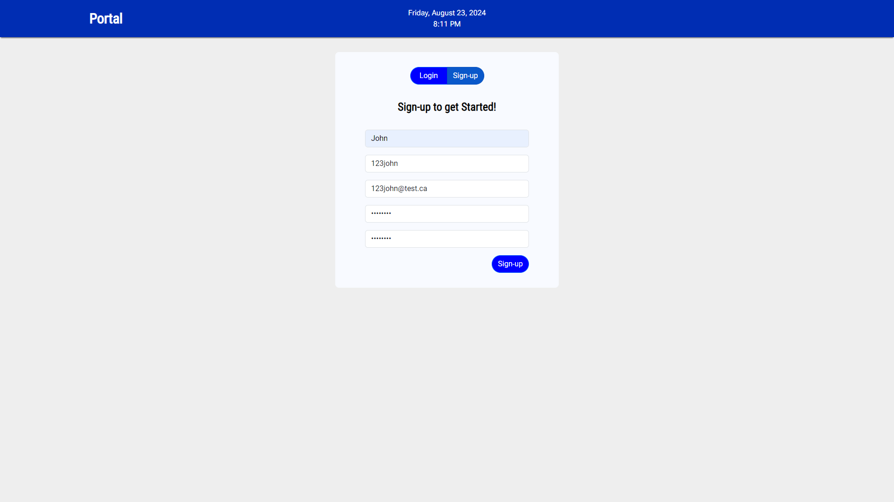
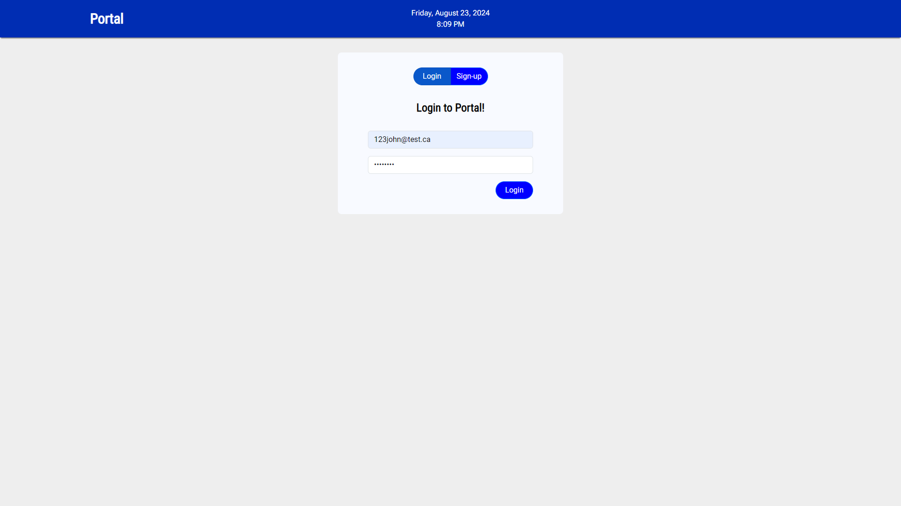
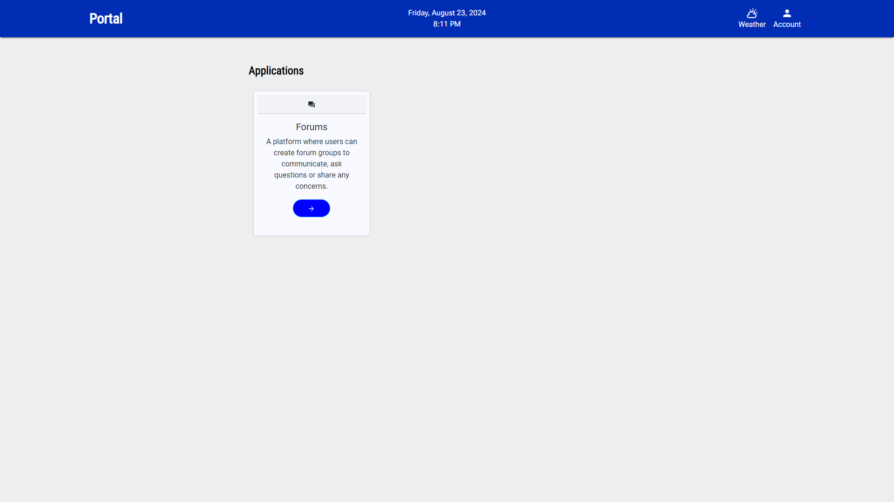
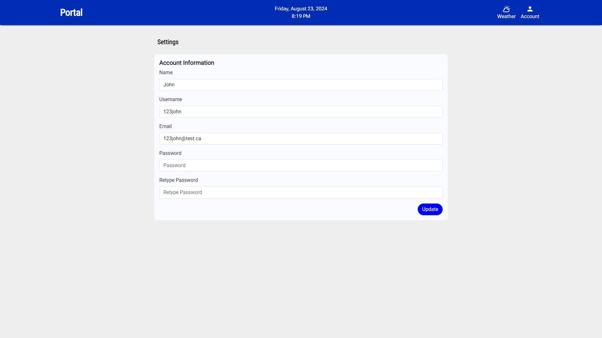
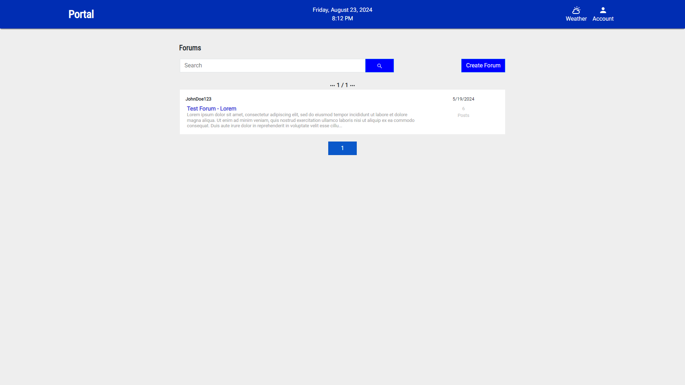
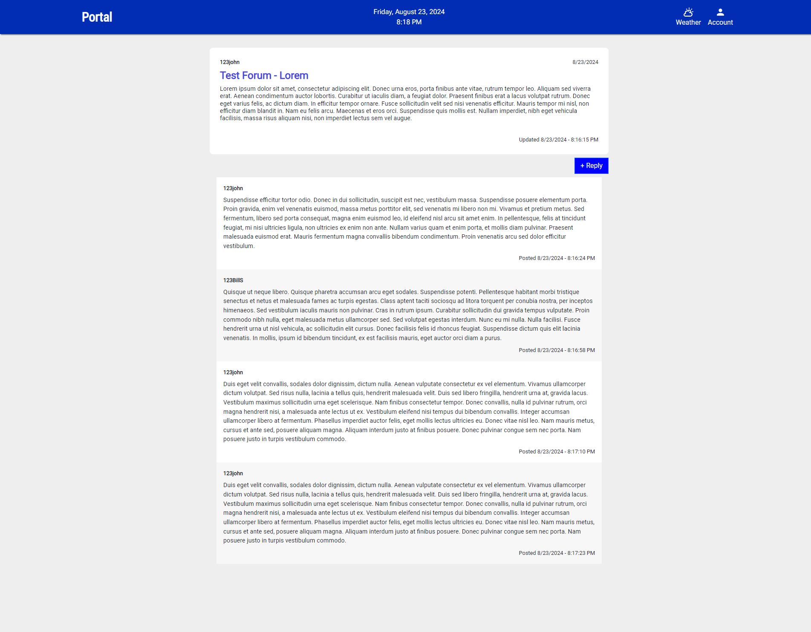

# Portal

## Table of Contents

- [Overview](#overview)
- [Technologies Used](#technologies-used)
- [Features](#features)
- [Application Screenshots](#application-screenshots)
- [License](#license)

## Overview

Portal is a versatile web application designed to host various applications within a unified interface. Currently, it features a real-time user forum, with future plans for expanding its functionality to include a calendar, file storage, and more. Built with scalability, security, and ease of use in mind, Portal is a powerful tool for managing multiple web-based services.

## Technologies Used

- **Frontend**:

  - HTML5
  - CSS3
  - JavaScript (ES6+)
  - React.js (React Vite)
  - React Bootstrap
  - Redux Toolkit

- **Backend**:

  - JavaScript (ES6+)
  - Node.js
  - Express.js

- **Database**:

  - MongoDB

- **Tools & Utilities**:
  - Git

## Features

- **Unified Interface**: Seamlessly host and access multiple web applications from a single platform.
- **Real-Time User Forum**: Engage in discussions through a fully functional forum that updates in real-time.
- **Scalability**: Easily integrate additional web applications, such as a calendar and file storage, to expand the platform's capabilities.
- **Secure Authentication**: Implements secure login and registration using JSON Web Tokens (JWT) and bcrypt.js for password encryption.

## Application Screenshots

- **Portal Signup**\
   Users can sign up for the Portal service on this page.
  

- **Portal Login**\
   After signing up, users can log in using their email and password.
  

- **Portal Home**\
  The home page provides users with access to a dashboard of applications. Currently, only the Forums application is available, with more applications planned for future integration.
  

- **Portal Settings**\
   Users can update their account information on the settings page.
  

- **Portal Forums**\
   After selecting the Forums app from the home page, users can create new forums or join existing ones.
  

- **Portal Forum Demo**\
   A demo of a forum room where two users can communicate in real-time.
  

## License

This project is licensed under the Apache License - see the [LICENSE](LICENSE) file for details.
